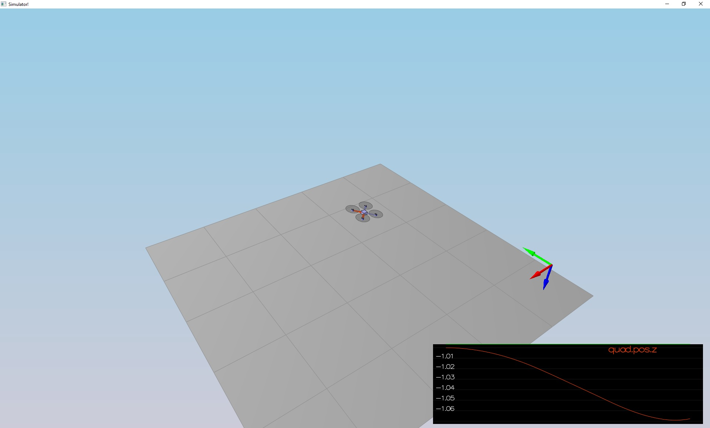
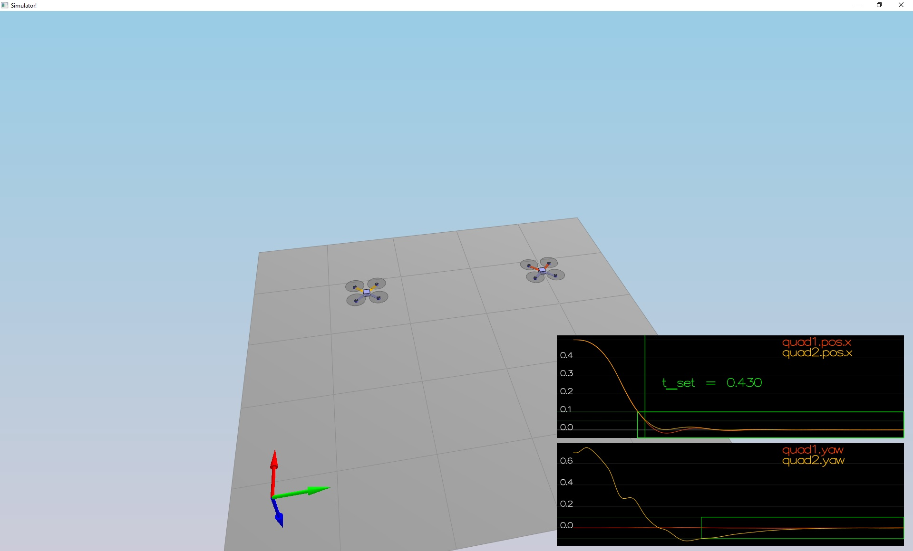
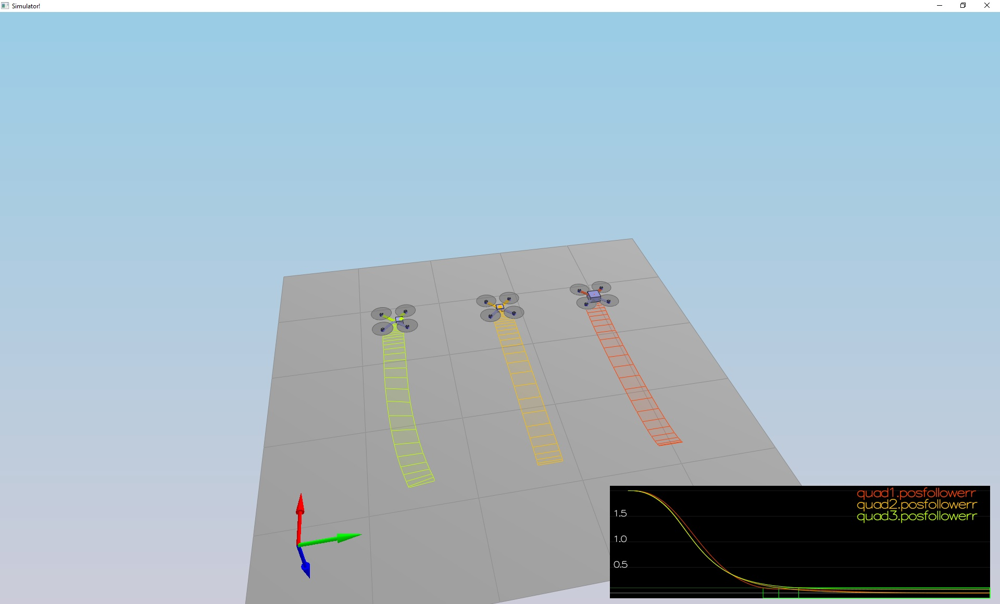
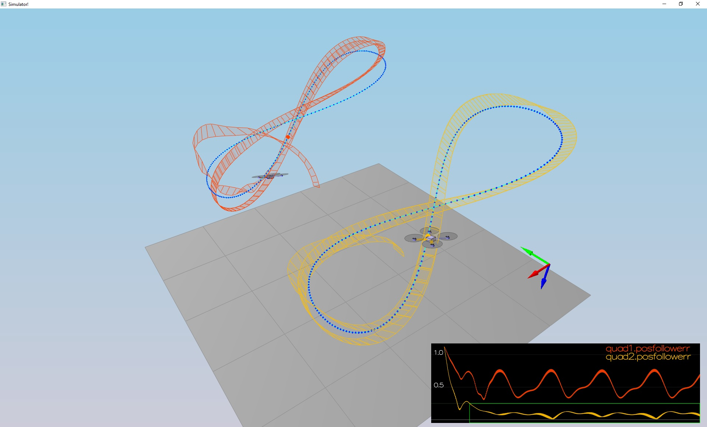

# FCND-Controls-CPP project Submission #

Submission for the FCND-Controls-CPP project for Philippe Doucette.

Revision for resubmittal:

My prior submittle passed all tests on my computer, but again I missed copied some parameters to my subittal.

Everything should pass now with the files submitted. I corrected 'QuadControlParams.txt' 

```
SIMULATOR!
Select main window to interact with keyboard/mouse:
LEFT DRAG / X+LEFT DRAG / Z+LEFT DRAG = rotate, pan, zoom camera
W/S/UP/LEFT/DOWN/RIGHT - apply force
C - clear all graphs
R - reset simulation
Space - pause simulation
Simulation #1 (../config/1_Intro.txt)
Simulation #2 (../config/1_Intro.txt)
PASS: ABS(Quad.PosFollowErr) was less than 0.500000 for at least 0.800000 seconds
Simulation #3 (../config/1_Intro.txt)
PASS: ABS(Quad.PosFollowErr) was less than 0.500000 for at least 0.800000 seconds
Simulation #4 (../config/2_AttitudeControl.txt)
Simulation #5 (../config/2_AttitudeControl.txt)
PASS: ABS(Quad.Roll) was less than 0.025000 for at least 0.750000 seconds
PASS: ABS(Quad.Omega.X) was less than 2.500000 for at least 0.750000 seconds
Simulation #6 (../config/2_AttitudeControl.txt)
PASS: ABS(Quad.Roll) was less than 0.025000 for at least 0.750000 seconds
PASS: ABS(Quad.Omega.X) was less than 2.500000 for at least 0.750000 seconds
Simulation #7 (../config/3_PositionControl.txt)
Simulation #8 (../config/3_PositionControl.txt)
PASS: ABS(Quad1.Pos.X) was less than 0.100000 for at least 1.250000 seconds
PASS: ABS(Quad2.Pos.X) was less than 0.100000 for at least 1.250000 seconds
PASS: ABS(Quad2.Yaw) was less than 0.100000 for at least 1.000000 seconds
Simulation #9 (../config/3_PositionControl.txt)
PASS: ABS(Quad1.Pos.X) was less than 0.100000 for at least 1.250000 seconds
PASS: ABS(Quad2.Pos.X) was less than 0.100000 for at least 1.250000 seconds
PASS: ABS(Quad2.Yaw) was less than 0.100000 for at least 1.000000 seconds
Simulation #10 (../config/4_Nonidealities.txt)
Simulation #11 (../config/4_Nonidealities.txt)
PASS: ABS(Quad1.PosFollowErr) was less than 0.100000 for at least 1.500000 seconds
PASS: ABS(Quad2.PosFollowErr) was less than 0.100000 for at least 1.500000 seconds
PASS: ABS(Quad3.PosFollowErr) was less than 0.100000 for at least 1.500000 seconds
Simulation #12 (../config/4_Nonidealities.txt)
PASS: ABS(Quad1.PosFollowErr) was less than 0.100000 for at least 1.500000 seconds
PASS: ABS(Quad2.PosFollowErr) was less than 0.100000 for at least 1.500000 seconds
PASS: ABS(Quad3.PosFollowErr) was less than 0.100000 for at least 1.500000 seconds
Simulation #13 (../config/5_TrajectoryFollow.txt)
Simulation #14 (../config/5_TrajectoryFollow.txt)
PASS: ABS(Quad2.PosFollowErr) was less than 0.250000 for at least 3.000000 seconds
Simulation #15 (../config/5_TrajectoryFollow.txt)
PASS: ABS(Quad2.PosFollowErr) was less than 0.250000 for at least 3.000000 seconds
```

Everything that follows was reviewed previously and passed, including source code *******************************************************

### Files Modified and Added ###

The following files were modified:

`src/QuadControl.cpp`
 Primary source code for PID controller
 
`src/QuadControl.h`
 Minor modifications, adding variable declarations used in debug and testing code

`config/QuadControlParams.txt`
 Tuned parameters for PID controller
 
`config/6_Vertical.txt` and `7_Horizontal.txt`
 Additional Scenarios used to fine tune the controller parameters (Try them!)

`config/Scenarios.txt`
 List of scenarios that populates the right-click popup menu.  6 and 7 were added.
 
### The Code ###

For the project, the majority of my code modifications are in `QuadControl.cpp`.  I added a few variables to `QuadControl.h` that I used for debugging and tuning.

I tuned `QuadControlParams.txt` while writing the controller code and running scenarios.

I wrote two additional scenarios to help me tune the PID controller: 
 `6_Vertical.txt` flies the quads straight up and down (by modifying the start/end trajectories).  I could then examine the overshoot and tune the kpVelZ parameter.  
 `7_Horizontal.txt` is really just a drastic version of `4_Nonidealities` that I could modify for my own needs without polluting the pass/fail scenario.


### The Simulator ###

The `config/Scenarios.txt` was modified to add two additional scenarios used to fine tune the controller parameters.  I found it difficult to tune the vertical parameters with the scenarios supplied.

### Testing it Out (scenario 1) ###

The thrusts are simply being set to:

```
QuadControlParams.Mass * 9.81 / 4
```

I tuned the `Mass = 0.5` parameter in `QuadControlParams.txt` to make the vehicle more or less stay in the same spot.

With the proper mass, the simulation looked like this:

<p align="center">

</p>

This code was later commented out and replaced with controller code.

### Body rate and roll/pitch control (scenario 2) ###

Implemented the body rate and roll / pitch control. 

**Implemented body rate control**

 - Implemented the code in the function `GenerateMotorCommands()`
```c++
VehicleCommand QuadControl::GenerateMotorCommands(float collThrustCmd, V3F momentCmd)
{
  float l = L / (float)sqrt(2);

  float tau_x = momentCmd.x / l;
  float tau_y = momentCmd.y / l;
  float tau_z = momentCmd.z / -kappa;

  float thrust_1 = (collThrustCmd + tau_x + tau_y + tau_z) / 4; // front left
  float thrust_2 = (collThrustCmd - tau_x + tau_y - tau_z) / 4; // front right
  float thrust_3 = (collThrustCmd + tau_x - tau_y - tau_z) / 4; // rear left These last two may be backwards
  float thrust_4 = (collThrustCmd - tau_x - tau_y + tau_z) / 4; // rear right

  cmd.desiredThrustsN[0] = thrust_1; // front left
  cmd.desiredThrustsN[1] = thrust_2; // front right
  cmd.desiredThrustsN[2] = thrust_3; // rear left
  cmd.desiredThrustsN[3] = thrust_4; // rear right

  //cmd.desiredThrustsN[0] = mass * 9.81f / 4.f; // front left
  //cmd.desiredThrustsN[1] = mass * 9.81f / 4.f; // front right
  //cmd.desiredThrustsN[2] = mass * 9.81f / 4.f; // rear left
  //cmd.desiredThrustsN[3] = mass * 9.81f / 4.f; // rear right
    
  return cmd;
}
```
 - Implement the code in the function `BodyRateControl()`
```c++
V3F QuadControl::BodyRateControl(V3F pqrCmd, V3F pqr)
{
  V3F MOI = (Ixx, Iyy, Izz);
  V3F rate_error = pqrCmd - pqr;
  momentCmd = MOI * (kpPQR * rate_error); 
  
  return momentCmd; 
}
  ```
 
 - Tuned `kpPQR` in `QuadControlParams.txt` to get the vehicle to stop spinning quickly but not overshoot

**Implement roll / pitch control**

 - Implemented the code in the function `RollPitchControl()`
```c++
V3F QuadControl::RollPitchControl(V3F accelCmd, Quaternion<float> attitude, float collThrustCmd)
{
  V3F pqrCmd;
  Mat3x3F R = attitude.RotationMatrix_IwrtB();

  float target_R13 = -CONSTRAIN(accelCmd[0] / c_d, -maxTiltAngle, maxTiltAngle);
  float target_R23 = -CONSTRAIN(accelCmd[1] / c_d, -maxTiltAngle, maxTiltAngle);

  pqrCmd[0] = (1 / R(2, 2)) * (-R(1, 0) * kpBank * (R(0, 2) - target_R13) + R(0, 0) * kpBank * (R(1, 2) - target_R23));
  pqrCmd[1] = (1 / R(2, 2)) * (-R(1, 1) * kpBank * (R(0, 2) - target_R13) + R(0, 1) * kpBank * (R(1, 2) - target_R23));

  return pqrCmd;
}
  ```
 - Tuned `kpBank` in `QuadControlParams.txt` to minimize settling time but avoid too much overshoot

Successful, as the quad leveled itself, and the vehicle angle (Roll) gets controlled to 0.

<p align="center">

</p>


### Position/velocity and yaw angle control (scenario 3) ###

 - Implemented the code in the function `LateralPositionControl()` velCmd.x and velCmd was added to assignment later (see below).
 ```c++
 V3F QuadControl::LateralPositionControl(V3F posCmd, V3F velCmd, V3F pos, V3F vel, V3F accelCmdFF)
{
  accelCmdFF.z = 0;
  velCmd.z = 0;
  posCmd.z = pos.z;
  
  V3F accelCmd = accelCmdFF;

  velCmd.x = kpPosXY * (posCmd.x - pos.x) + velCmd.x;
  velCmd.y = kpPosXY * (posCmd.y - pos.y) + velCmd.y;

  //Limit speed
  float velocity_norm = sqrt(velCmd.x* velCmd.x + velCmd.y * velCmd.y);
  if (velocity_norm > maxSpeedXY)
  {
    velCmd.x = velCmd.x * maxSpeedXY / velocity_norm;
    velCmd.y = velCmd.y * maxSpeedXY / velocity_norm;
  }

  accelCmd = accelCmdFF + kpPosXY * (posCmd - pos) + kpVelXY * (velCmd - vel);

  //Limit acceleration
  float accel_norm = sqrt(accelCmd.x* accelCmd.x + accelCmd.y * accelCmd.y);
  if (accel_norm > maxAccelXY)
  {
    accelCmd.x = accelCmd.x * maxAccelXY / accel_norm;
    accelCmd.y = accelCmd.y * maxAccelXY / accel_norm;
  }
  
  return accelCmd;
} 
```
 - Implemented the code in the function `AltitudeControl()`.  The integratedAltitudeError values was added later in scenario 4.
```c++
float QuadControl::AltitudeControl(float posZCmd, float velZCmd, float posZ, float velZ, Quaternion<float> attitude, float accelZCmd, float dt)float QuadControl::AltitudeControl(float posZCmd, float velZCmd, float posZ, float velZ, Quaternion<float> attitude, float accelZCmd, float dt)
{
  Mat3x3F R = attitude.RotationMatrix_IwrtB();   
  float thrust = 0;
  
  velZCmd = kpPosZ * (posZCmd - posZ) + velZCmd;

  // Limit the ascent / descent rate
  velZCmd = CONSTRAIN(velZCmd, -maxDescentRate, maxAscentRate);

  integratedAltitudeError += (posZCmd - posZ) * dt;
  accelZCmd = kpVelZ * (velZCmd - velZ) + KiPosZ * integratedAltitudeError + accelZCmd;

  thrust = mass * (9.81f -accelZCmd) / R(2, 2);  

  if (thrust > maxMotorThrust * 4)
	   thrust = maxMotorThrust * 4;
  else if (thrust < minMotorThrust * 4)
	   thrust = minMotorThrust * 4;

  return thrust;
}
```
 - Tuned parameters `kpPosXY` and  `kpVelXY`
 - Tuned parameters `kpPosZ` and `kpVelZ`

If found it difficult to tune `kpPosZ` and `kpVelZ` with the supplied scenarios, so I wrote `6_Vertical.txt`. With it, I was able to move a quad vertically several meters and stop it to observe the overshoot.  I could then eliminate the overshoot while still aggressively moving toward the trajectory point.

Similarly, I wrote `7_Horizontal.txt` to tune `kpPosXY` and  `kpVelXY`.  However, I found that the strong values I tuned had to be relaxed later in scenario 5 when the trajectory point is moving.

At this point in scenario 3, without yaw control, one quad remained rotated in yaw.

 - Implement the code in the function `YawControl()`
```c++
float QuadControl::YawControl(float yawCmd, float yaw)
{
  float yawRateCmd = 0;
   
  float PI = (float)M_PI;
  yawCmd = fmodf(yawCmd, 2.f * PI);
  float yawRateError = yawCmd - yaw;

  if (yawRateError > M_PI)
    yawRateError = yawRateError - 2.f*PI;
  else if(yawRateError < -M_PI)
    yawRateError = yawRateError + 2.f*PI;

  yawRateCmd= kpYaw * yawRateError;
}
```
 - Tuned parameters `kpYaw` and the 3rd (z) component of `kpPQR`

<p align="center">

</p>

### Non-idealities and robustness (scenario 4) ###

1. Ran controller & parameter set from Step 3.  Had to tweak the controller parameters to work for all 3.  Also used `7_Horizontal.txt`.

2. Edited `AltitudeControl()` to add basic integral control to help with the different-mass vehicle.

```c++
  integratedAltitudeError += (posZCmd - posZ) * dt;
  accelZCmd = kpVelZ * (velZCmd - velZ) + KiPosZ * integratedAltitudeError + accelZCmd;
```

3. Tuned the integral control, and other control parameters until all the quads successfully moved properly.  

<p align="center">

</p>


### Extra Challenge 1 (Optional) ###

"You will notice that initially these two trajectories are the same. Let's work on improving some performance of the trajectory itself.

1. Inspect the python script `traj/MakePeriodicTrajectory.py`.  Can you figure out a way to generate a trajectory that has velocity (not just position) information?"

The code could be modified to return velocity by simply remembering x,y,z from prior loop iterations and calculating dx, dy, dz and calculating velocities using dt.   Like this: vel.x = (prior_x - x) * dt.

The trajectory used in Quad 2 contains `curTrajPoint` of datatype `TrajectoryPoint` defined as follows:
```c++
  TrajectoryPoint() :
    time(0.f),
    position(0.f, 0.f, 0.f),
    velocity(0.f, 0.f, 0.f),
    omega(0.f, 0.f, 0.f),
    attitude(0.f, 0.f, 0.f, 0.f)
  {
```
So it already had velocity data in it.  I mearly added it to the velocity command computation in `LateralPositionControl`:
```c++
  velCmd.x = kpPosXY * (posCmd.x - pos.x) + velCmd.x;
  velCmd.y = kpPosXY * (posCmd.y - pos.y) + velCmd.y;
```
... so that the velCmd can take advangage of the `curTrajPoint.velocity` from the call statement:
```c++
  LateralPositionControl(curTrajPoint.position, curTrajPoint.velocity, estPos, estVel, curTrajPoint.accel);
```

"2. Generate a new `FigureEightFF.txt` that has velocity terms
Did the velocity-specified trajectory make a difference? Why?"

Yes, it made a huge difference.  The quad was not able to track trajectory closer then about 1/2 meter, no matter how I adjusted the parameters.  Adding the trajectory velocity to the command enabled very close tracking, within the performance criteria.

<p align="center">

</p>


### Extra Challenge 2 (Optional) ###

"For flying a trajectory, is there a way to provide even more information for even better tracking?

How about trying to fly this trajectory as quickly as possible (but within following threshold)!"

Yes.  Adding acceleration to the trajectories would give the PID controller a sort of warning about what is comming next.  Adding this value could be used to adjust quad acceleration and prevent overshoot.

### Performance Metrics ###

All performance metrics were accomplished:

 - scenario 2
   - roll should less than 0.025 radian of nominal for 0.75 seconds (3/4 of the duration of the loop)
   - roll rate should less than 2.5 radian/sec for 0.75 seconds

 - scenario 3
   - X position of both drones should be within 0.1 meters of the target for at least 1.25 seconds
   - Quad2 yaw should be within 0.1 of the target for at least 1 second
 
 - scenario 4
   - position error for all 3 quads should be less than 0.1 meters for at least 1.5 seconds

 - scenario 5
   - position error of the quad should be less than 0.25 meters for at least 3 seconds
